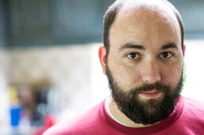

<figure class="right">
    
    <figcaption>
        Photo courtesy of <a href="http://sebastianorrphoto.com/">Sebastian Orr Photography</a>
    </figcaption>
</figure>

I am a professional software developer working primarily to build web systems
alongside expressive APIs. I am currently living in the Atlanta area and am
employed with the Emerging Threats and Countermeasures laboratory at the Georgia
Institute of Technology.

## Interests

At work, I am interested in designing user interfaces for expert users, as
well as discovering and developing simple and understandable solutions to
complex problems.

Personally, I am quite interested in politics, gaming (video, card and board),
and free and open source systems (and their assorted accoutrements), brewing
beer and good bourbon.

## Projects

I have worked on a number of (mostly half-baked) ideas:

* [Window mangers](projects/piswm.html)
* [Arch User Repository helpers](projects/aurora.html)
* [Internet radio players fronted by dmenu](projects/ztream.html)

You can find more information about almost any of these ideas on
[my Github](http://github.com/bbenne10) or on the [projects page](projects/index.html)
