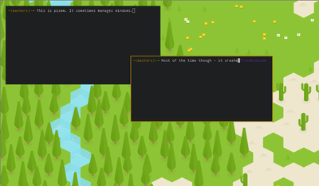

#piswm

###Stupid window manager written in python and xpyb. (Still not stable)

####Download
Piswm can be grabbed from it's [Github page](http://github.com/bbenne10/piswm).

####Screenshot
Piswm doesn't really look like much, but announcing a window manager without a
screenshot is silly.

<figure>
    

    <figcaption>
        piswm as of 2015-01-03
    </figcaption>
</figure>

####Usage
Don't. If you must and you have problems, email me. Better yet - open an issue on
Github and send a pull request ;)
