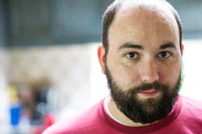

## Who am I?

Bryan Bennett, as you know. You made it to this domain after all.
My pronouns are he/him/his.

I'm a software developer, working for the [CIPHER lab at GTRI][GTRI].
Mostly, I write web services and pretend to be a "software architect".
Sometimes, I get to play around with cooler things like formal verification, software-assurance, functional languages, etc.
I live in Atlanta with my small family.
I try to get outdoors when I can.

I'm a member of Phi Mu Alpha Sinfonia, a social music fraternity.
I am a past-president of the Atlanta-Area Alumni Association actually.

Basically, I'm just a dad who likes loud music,
has strong opinions about computers
and enjoys walking and sitting in the woods.

## What is this?

That remains to be seen.
I'll eventually add some overlays about some of my projects here or something. 
For now, you can find me in the places linked below.

### This is a cool color scheme!

Isn't it? 
It's called [earl grey][] and I think it's really neat.

Thanks, [June][]!

[GTRI]: https://gtri.gatech.edu/laboratories/cybersecurity-information-protection-and-hardware-evaluation-research
[earl grey]: https://earl-grey.halt.wtf/
[June]: https://halt.wtf
